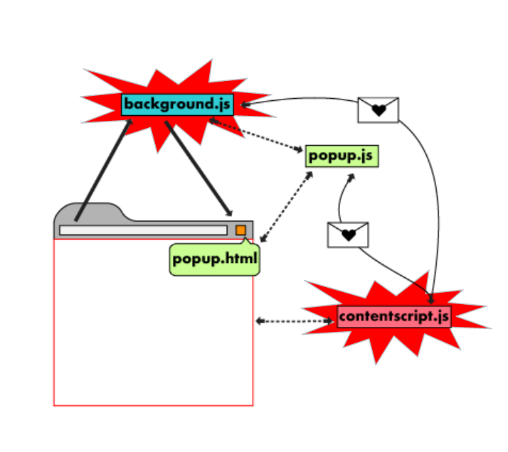

# Browser Extension Development



| browser | location            |
| ------- | ------------------- |
| CHROME  | chrome://extensions |
| FIREFOX | about:addons        |

## Features

1. Sidebars
2. popus windows

## Tooling

https://extensionworkshop.com/documentation/develop/getting-started-with-web-ext/

android firefox

```
web-ext run --target=firefox-android --android-device=emulator-5554
```

## Publishing

| browser                                              | info                                  |
| ---------------------------------------------------- | ------------------------------------- |
| chrome                                               | costs **5-USD** for developer account |
| [firefox](https://addons.mozilla.org/en-US/firefox/) |

## References

- https://developer.mozilla.org/en-US/docs/Mozilla/Add-ons/WebExtensions
- [Examples](https://github.com/mdn/webextensions-examples)
